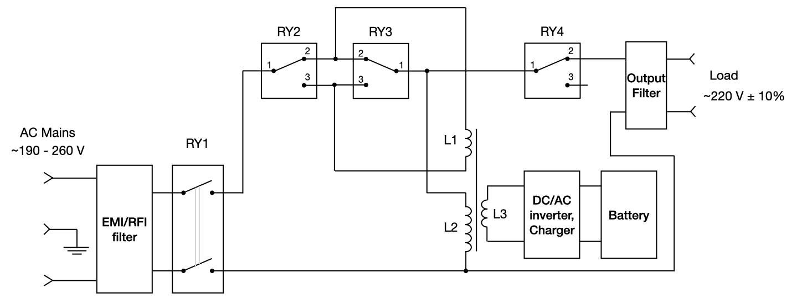

# Line-interactive UPS on Arduino
This project is implementing core functions of a basic single-phase line-interactive UPS using Arduino. The main idea is to have a fully functional controller, which can manage display indication, relays, invertor and sensors and also support external communication based on the [Voltronic protocol](https://networkupstools.org/protocols/voltronic.html). 

## Introduction 

The central part of a typical line-interactive UPS is a Big Iron Transformer, which plays the role of a back-boost voltage regulator with help of relays. 

    

    

If the input voltage is within the acceptable limits (230V +/- 10%) then the UPS passes it to the load with no changes, just applying EMI/RFI and load filters. But once the voltage is deviating for more than 10%, the relays are switching to ensure voltage back or boost, depending on the sign of deviation. 

Finally, if the input voltage is beyond the limits of back/boost regulation then the input relay is disconnected and the invertor kicks in to ensure the uninterrupted power feed to the load.

Since the invertor is taking power form the battery, the latter needs to be charged when the load is powered from the mains. There are different options how the charger can be implemented but the most recent ones involve some sort of fast-switching voltage convertors maintaining the required charging current by pulse-width modulation.

The line-interactive UPS controller features implemented in this project include:

1. Manage UPS relays to ensure the back/boost regulation of the output voltage when on AC power.
2. Automatically switch on the inverter once the AC power falls beyond the regulation limits and safely return to the AC once the mains power is restored back to normal.
3. Support user-friendly display indication. There are numerous display options for the UPS so for this project, an indicator based on [TM1640 chip](https://www.alldatasheet.com/datasheet-pdf/pdf/1133630/TITAN/TM1640.html) has been re-used from a broken commercial UPS. One can modify or amend the Display class (see Display.h and .cpp ) in case if different hardware is to be supported.   
4. Display switch on/off and brightness regulation
5. Support of pulse-width modulated output for driving the battery charging process.
6. Support of the sensors: input/output voltage, output current (load), battery voltage and current, temperature (TBA)
7. Support of the UPS sound indication (buzzer).
8. Support of the self-test scenario 
9. Support of the standby/restore scenario
10. Serial communication based on [Voltronic protocol](https://networkupstools.org/protocols/voltronic.html) implementation. See supported commands below:

## Configuration
Main parameters are set in the **config.h** and can be tweaked based on the Arduino board used. The solution is tested on the Arduino Nano board and 2x12V PbAc batteries. 

## Voltronic: supported commands
The solution supports most of the Voltronic commands. Some extensions are added to enable display and sensor management. Also, the default baud rate is set to 9600bps in order to minimize the blocking delays needed for the serial processing and allow more time for the main loop. However, the baud rate can be adjusted to the standard 2400bps in the **config.h**.

<table>
<thead><td><b>Command</b></td><td><b>Description</b></td></th></thead>
<tbody>
<tr><td>M</td><td>Returns the Voltronic protocol. Currently only 'V' is supported</td></tr>
<tr><td>Q</td><td>Toggle the UPS buzzer.</td></tr>
<tr><td>QS</td><td>Query UPS for status (short) (old)</td></tr>
<tr><td>QMD</td><td>Query UPS for rated information #1</td></tr>
<tr><td>QRI</td><td>Query UPS for rated information #2</td></tr>
<tr><td>QMF</td><td>Query UPS for manufacturer</td></tr>
<tr><td>QBV</td><td>Query UPS for battery information</td></tr>
<tr><td>D</td><td>Toggle display on or off</td></tr>
<tr><td>Dn</td><td>Set the brightness level for the display where <b>n</b> is representing the brightness level and can be from 0 to 4</td></tr>
<tr><td>T</td><td>Invoke a quick battery self-test</td></tr>
<tr><td>Tn</td><td>Invoke a battery self-test lasting n (.2→.9, 01→99) minutes</td></tr>
<tr><td>CT</td><td>Cancel the self-test</td></tr>
<tr><td>SnRm</td><td>Disconnect the load in n (.2→.9, 01→99) minutes and then connect again after m (0001..9999) minutes</td></tr>
<tr><td>CS</td><td>Re-connect the load or cancel the previous S command</td></tr>
<tr><td>VN</td><td>Print the scale factor and the offset of the sensor specified by the index N</td></tr>
<tr><td>VNPMVK...K</td><td>allows to tune or read sensor params, where: 
N - index of the sensor (1 digit). See the Sensors section below for the list of available indexes. 
M - can be 0 (scale) or 1 (offset). 
K...K - float value to be set (17 symbols, counting with the decimal dot).</td></tr>
<tr><td>W</td><td>Save the sensor params in the EEPROM</td></tr>
</tbody>
</table>

## Sensors
The crucial part of line-interactive UPS is a set of sensors measuring input and output voltage and current as well as battery parameters. It is very important to ensure that these sensors are configured and tuned correctly so that the UPS could function properly.

The comprehensive list of sensors is represented in the table below. Each sensor is characterized by two parameters: <I>scale factor</I> and <I>offset</I>, both of the float type. The purpose of these parameters is to transform the integer reading from the Arduino analog input to the voltage, or amperage, or temperature in physical units. 

<table>
<thead>
    <td><b>Index</b></td>
    <td><b>Purpose</b></td>
    <td><b>Limits</b></td>
    <td><b>Default scale</b></td>
    <td><b>Default offset</b></td>
</thead>
<tbody>
    <tr>
        <td>0</td>
        <td>Input voltage</td>
        <td>0...300VAC</td>
        <td>0.875</td>
        <td>0</td>
    </tr>
    <tr>
        <td>1</td>
        <td>Output voltage</td>
        <td>0...300VAC</td>
        <td>0.375</td>
        <td>0</td>
    </tr> 
    <tr>
        <td>2</td>
        <td>Output current</td>
        <td>0...9A</td>
        <td>0.007</td>
        <td>0</td>
    </tr>
    <tr>
        <td>3</td>
        <td>Battery voltage</td>
        <td>0...49.9V</td>
        <td>0.05298</td>
        <td>0</td>
    </tr>     
     <tr>
        <td>4</td>
        <td>Battery current</td>
        <td>-29.9...29.9A</td>
        <td>0.07362</td>
        <td>-37.61</td>
    </tr>           
</tbody>
</table>

## License
[GPLv3](/LICENSE)